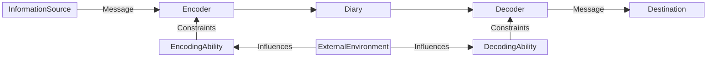

# 窓のコミュニケーションプロトコル(MadonoCommunicationProtocol)

## この文書の位置付け(Status of this memo)
この文書は自己を表現・記録するためのプロトコルを規定する。本プロトコルはヒトとヒトの界面において、自己の記録や記憶を他者に伝達するために使用できる。本プロトコルは「美学校 2024年度講座 建築大爆発」の修了展において、阿久津　朋宏制作の窓に初めて実装されたため、窓のコミュニケーションプロトコルと名付けた。この文書はクリエイティブコモンズ BY-NC-SA 4.0のもと配布される。

## 概要(Summary)
窓のコミュニケーションプロトコルは自己の記録や記憶を他者に伝達する手段を提供する。本プロトコルは物理的な支持体への実装を推奨するが、記憶装置などに記録できる情報として実装しても良い。

## 導入(Introduction)
### 窓の記憶について(About my memories of Mado)
「美学校 2024年度講座 建築大爆発」修了展のタイトル「裸で窓を見る」が決まり、本プロトコルの設計者(以下『私』と記述する)が窓について考えた時、自分の家の窓と他人の家の窓とが、見た目や構造としては似た機能を持っていても、ヒトがそれぞれの窓に抱いている記憶や感情の「質」や「重み」はまったく異なる可能性があるのではないかと気づいた。
私の最初期の記憶は、「部屋の窓から外を眺めている」場面である。窓は下半分が曇りガラスになっている引き違い窓で、まだ小さかった私が外を見るには背伸びをする必要があった。窓のすぐ向こうには庭があって、その奥に車庫があった。父の車は白のセダンで、母の車は赤い軽自動車だった。家族で出かける時は父のセダンで、良く落語や漫談のAMラジオを聴いていた。母の軽自動車に乗っている時、左のウィンカーが壊れて超速で点滅したのを見て、母と二人で「おかしいね」と言い合った記憶がある。私にとって、窓の内側から自分の物語を思い出すのは容易い。  
一方で、窓の外側から、内側に広がる物語を想像するのは難しい。私が東京で就職して2～3年が経つ頃、いつもの通勤途中に通る路地から、ある民家の2階をふと見上げると、泣きはらした後のような顔で窓から顔を出した高校生くらいの青年と目が合った。しかし、私と彼の精神は全くつながることはなかった。彼に何か主張したいことがあったのか、他人に聞いてもらいたい何らかの事情があったのか想像するだにできなかった。  
この経験は、窓が本来持っているはずの「異なる空間や環境をつなぐ界面」としての機能が、実際にはヒトとヒトの精神のつながりにおいては発揮されていないのではないか、という問いにつながった。  
そこで私は、窓をヒトとヒトとをつなぐ界面として捉え直すことを試みた。窓は、採光や断熱といった物理的機能に加え、視覚・音・匂いといった環境的要素を媒介し、ヒトとヒトの記憶や感情をも介在させうるメディアとして再定義できるのではないかと考え、窓を介したコミュニケーションの在り方を探究する本プロトコルの出発点となった。

### 日記について(About diary)
日記とは一般に市井のヒトが記す日々の記録である。近年、情報技術の発展に伴い、ブログやSNSなどの媒体上には膨大な量の日記が記録されている。また、企業が出版する著名人のエッセイや、個人が自費出版する同人誌・ZINEなど、規模の大小を問わず、市場には多くの日記が流通している。日記は一般に文字や数字で書かれており、書き手が特定の日をどのように過ごしたのか、何を考えたのか、などの情報が記載されている。読み手は日記をもとに、書き手の行動や心情を読み解ける。日記は記録者が自身の経験やアイデアを記録するのみならず、他人へ何らかの情報を伝達し、その情報から新たな知見を得る道具としても活用できる(Klimova, 2015)。他人への情報伝達を目的とした日記の形式として交換日記が挙げられる。交換日記とは、「読んで字のごとく、日記を複数人の間で交換して記述していくというものである」(山守, 2014)。ここで、あるヒト*A*が日記に書いた情報を、他のヒト*B*が読み解く状況を考える。*A*は、自身の経験やアイデア・考えたことなどを文字や数字で記す。*B*は、書かれた文字や数字を読む。*B*は、*A*と必ずしも時間・空間を共有しない。また、同じ経験をしたとしても想起する考えや記憶に残る事柄は異なる可能性がある。ここで、交換日記の情報伝達を分析するために、*A*と*B*の情報伝達をモデル化することを考える。
情報交換について著名なモデルとして、Shannon-Weaverのコミュニケーションモデルを下記に示す(Shannon, 1948)。

  
Fig.1 Shannon-Weaverのコミュニケーションモデル、"A mathematical theory of communication. Fig. 1" より引用  

INFORMATION SOURCEが伝達したい情報(MESSAGE)を、TRANSMITTERが電文などの形式(SIGNAL)に変換・送信し、RECEIVERが電文を受信してMESSAGEをDESTINATIONに渡す。
ここで、TRANSMITTERからRECEIVER間にはNOISE SOURCEの影響があり、電文が変化する可能性がある。電文が変化すると、INFORMATION SOURCEが伝達したい情報と、DESTINATIONが受け取る情報が異なってしまう。
今回、交換日記の情報交換モデルをShannonのコミュニケーションモデルを拡張して下記のように定義した。

  
Fig.2 交換日記の情報交換モデル  
*A*(InformationSource)が伝達したい情報(Message)は、*A*の持つ表現力(語彙量、知識量、比喩などの表現能力＝EncodingAbility)の制約を受けつつ、文字や音声などの記録手段(Encoder)を通じて日記(Diary)として記録される。*B* (Destination)は、Diaryを視覚や聴覚といった手段(Decoder)によって読み解き、Message を受け取るが、その際 *B* の読解力(*A*の状況や人格を踏まえた表現の理解能力＝DecodingAbility)に依存する。EncodingAbilityとDecodingAbilityは、表現規制、価値観の変化、人間関係といった社会的・文化的要因(ExternalEnvironment)によっても影響を受ける。日記に記録される情報の多くは文字や数字によって構成されるが、これらは日付や出来事といった客観的な事実の記録に適しており、民俗学などの研究対象として採用されてもいる(川村 et al., 2019)。実際、文字はもともと数量管理や税の記録などの目的で発明された数字にルーツを持つ(ハラリ, 2016)。しかしながら、文字は「記録の正確性」に優れている一方で、書き手の主観的経験や感覚、あるいは複雑なニュアンスといった、より個人的な内容を伝達するには限界がある。こうした情報の伝達には、より視覚的かつ身体的な手段が有効であると考えた。その一例が、インカ帝国で使用されていた「キープ（quipu）」である。キープは、複数の紐の結び目によって数字を表現する視覚的・触覚的な記録媒体であり、情報伝達の手段として機能していた(Ascher & Ascher, 1975)。しかしスペインによる征服の結果、インカ帝国は滅び、キープを読み解く技術や知識も失われた（ハラリ, 2016）。  
本プロトコルは、キープの構造と理念に着想を得て設計されたものである。文字による情報伝達の限界を補い、より多様な感覚に訴える視覚的プロトコルとして、キープの再構成を試みる。

## 目的(Objectives)
本プロトコルの目的は、個人の記録や記憶の他者への伝達を行う方法を提供するものである。

## 仕様(Specification)
本プロトコルは、ヒトの生活する時間を表す軸*t*と、ヒトの生活する地点を表す軸*d*と、前記2軸によって作られる*m*次元空間上に自己の存在した時空間を記録した点集合*S*、ある時空感情の点*p*における記録者の行動や感情を記録する点集合*T*、前記点集合をすべて通るヒトの生活する時空間上の移動を表す多角線*l*によって構成される。プロトコルに沿って自身の記録をつけるヒトを記録者と呼称する。それぞれの要素の詳細を以下に記述する。

### ヒトの生活する時間を表す軸*t*
ヒトの生活する時間を表す軸*t*は、記録者の存在する日付・時刻・期間など時間の長さと方向を表す。軸*t*は直線でも曲線でも良いし、円や矩形などの幾何学図形でも良い。解釈を簡便にするために単純増加または単純減少する軸を推奨するが、独自の規則により時間の長さと方向を定義しても良い。また、例えば心理的の感じた時間の長短によって軸を伸縮させるなど、軸の一部で異なる規則を適用しても良い。

### ヒトの生活する地点を表す軸*d*
ヒトの生活する地点を表す軸*d*は、記録者の存在する地理的な地点を表す。軸*d*は直線でも曲線でも良いし、円や矩形などの幾何学図形でも良い。記録者の地理的な移動を、軸*d*に沿った移動で表す。軸*d*と同様に、独自の規則により時間の長さと方向を定義しても良い。また、心理的に感じた移動距離に応じて軸を伸縮させるなど、軸の一部で異なる規則を適用しても良い。軸*t*と軸*d*は一部・または全部が一致していても良いし、一部・または全部が独立していても良い。

### 軸*t*と軸*d*で作られる*m*次元空間上に自己の存在した時空間を記録した点集合*S*
軸*t*と軸*d*で作られる*m*次元空間上に自己の存在した時空間を記録した点集合*S*は、軸*t*と軸*d*で張られる*m*次元空間上に存在する点の集合であり、記録者が実際に存在していた時刻と場所の対応関係を表す。  
各点 $p_i \in S$ は、時刻 $t_i$ および位置 $d_i$ における記録者の存在を示し、集合 *S* は次のように表現される。
```math
S = \{ p_i = (t_i, d_i) \in M \mid i = 0, 1, 2, \ldots, n \}
```
ここで *M* は軸 *t* と *d* によって定義される*m*次元空間であり、*n* は記録された点の総数である。
記録者が意識的に「存在した」と認識した時空間のみを点として記録してもよく、記録の間隔に制約はない。

### ある時空感情の点*p*における記録者の行動や感情を記録する点集合*T*
ある時空感情の点*p*における記録者の行動や感情を記録する点集合*T*は、*S*の部分集合である。記録者は任意の点 $p_i$ を選び、他の点 $p_k \notin T$ とは何らかの知覚的な手段によって区別ができるよう記録できる。例えば、色や音、大きさを変えて表現するなどである。点集合*T*の表現方法は実装や記録者の属する文化などに依存する。典型的な例は、感情の喜怒哀楽をそれぞれ色に対応させて表現する方法である。一例として、喜の気持ちには暖色系の色を割り当て、哀の暗い気持ちには寒色系の色を割り当てるなどである。

### 点集合*p*をすべて通るヒトの生活する時空間上の移動を表す多角線*l*
点集合*p*をすべて通るヒトの生活する時空間上の移動を表す多角線*l*は、軸*t*と軸*d*で作られる*m*次元空間上に自己の存在した時空間を記録した点集合*S*を時系列などの規則に応じて順に結び、記録者がどのように時空間を移動したかを視覚的に示す。
多角線*l*は次のように定式化される。
```math
l = \left\{ [p_i, p_{i+1}] \;\middle|\; i = 0, 1, 2, \dots, n - 1 \right\}
```
## 実装例(Implementation Example)
本プロトコルの実装例を下記に示す。
実装例は物理的な窓としての使用を想定して製作された。写真を下記に示す。

この窓は木枠と、直径6mmの建築用鉄筋で作られた内枠と、糸およびカラー紐から構成される。鉄筋の垂直方向は軸*t*、鉄筋の水平方向は軸*d*、黄色のカラー紐は点集合*S*と*T*、および多角線*l*にそれぞれ対応する。鉄筋枠の上端は日本時間の0時、下端は日本時間の24時直前の時間を表す。プロトコル仕様より黄色のカラー紐1本は24時間の記録者の時空感情の移動を表現している。糸は鉄筋の左右端を結んでおり、垂直方向に均等間隔で7本張られている。従って、鉄筋上端と鉄筋上端から1本目の糸、ある糸と隣り合う糸、鉄筋下端と鉄筋下端から1本目の糸それぞれの時間間隔は3時間となる。また、紫、青、赤のカラー紐は点集合*T*を表す。
ここで、下記の黄色いカラー紐で表された、記録者のある24時間の時空間の移動と感情の記録について読み取りを試みる。対象とするのは緑の枠線で囲った黄色いカラー紐である。

記録者は午前0時から午前9時にはある1点に存在した。午前9時には別の場所に移動し、そこで9時間ほど過ごしたあと元いた場所に戻ったとわかる。また午前6時、午後1時、午後3時ごろに何らかの行動をした、あるいは何らかの感情の動きがあったと分かる。ここで、記録者は起床を紫、嬉しい気持ちを赤、悲しい・しんどい気持ちを青で表現している。
また、複数の箇所である黄色いカラー紐が、他のある黄色いカラー紐に絡んでいる。これは、記録者が、ある日と前後の日との連続性を感じていることを示唆している。

## ライセンス(License)
この文書はクリエイティブコモンズ BY-NC-SA 4.0のもと配布される。

## 参考文献(References)
Ascher, M., & Ascher, R. (1975). The Quipu as a Visible Language. Visible Language, 9(4), Article 4. https://journals.uc.edu/index.php/vl/article/view/5194  
Klimova, B. (2015). Diary writing as a tool for students’ self-reflection and teacher’s feedback in the course of academic writing. Procedia-Social and Behavioral Sciences, 197, 549–553.  
Shannon, C. E. (1948). A mathematical theory of communication. The Bell System Technical Journal, 27(3), 379–423.  
川村清志, カワムラキヨシ, 小池淳一, & コイケジュンイチ. (2019). [論文] 民俗学における日記研究の展開とその可能性. 国立歴史民俗博物館研究報告, 214, 195–217.  
ユヴァル・ノヴァ・ハラリ. (2016). サピエンス全史　上　文明の構造と人類の幸福. 河出文庫.  
山守伸也. (2014). 現代日本における< 日記メディア> と< 日記行為> の文化社会学的考察: 自己・関係・社会の 「可視化」 装置としての日記. https://kansai-u.repo.nii.ac.jp/record/193/files/KU-0010-20140331-14.pdf  
